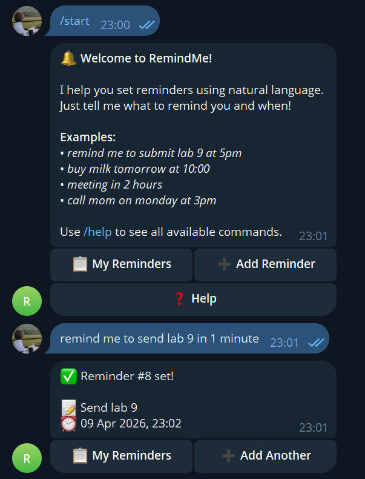
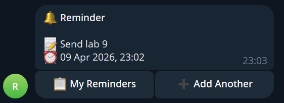

# RemindMe — Smart Reminder Telegram Bot

A Telegram bot that lets you create reminders in natural language and delivers them at the right time.

## Demo





## Context

### End Users

Busy students and professionals who forget deadlines, meetings, and tasks.

### Problem

People forget important tasks and switching to a separate reminder app is friction.

### Solution

This bot lets a user type a reminder naturally (e.g. "remind me to submit lab 9 at 5pm") directly in Telegram — the app they already use — and delivers the reminder at the scheduled time. No extra app needed.

## Features

### Implemented (Version 1)

- ✅ Natural language reminder parsing (no LLM required)
- ✅ `/start` — Welcome message with inline keyboard
- ✅ `/help` — List of available commands
- ✅ `/remind <text>` — Create a reminder from text
- ✅ `/list` — View all pending reminders
- ✅ `/delete <id>` — Remove a reminder by ID
- ✅ Natural text input (just type without any command)
- ✅ Background scheduler that delivers reminders on time
- ✅ PostgreSQL database for persistent storage
- ✅ Docker Compose for easy deployment
- ✅ Test mode (`--test`) for development

### Planned (Version 2)

- 🔲 LLM-powered intent routing for better natural language understanding
- 🔲 Recurring reminders (daily, weekly, monthly)
- 🔲 Reminder categories and tags
- 🔲 Inline keyboard for quick actions on reminders
- 🔲 Snooze functionality
- 🔲 Rich text formatting in notifications

## Usage

### Commands

| Command | Description |
|---------|-------------|
| `/start` | Welcome message |
| `/help` | Show all available commands |
| `/remind <text>` | Set a reminder |
| `/list` | List your pending reminders |
| `/delete <id>` | Delete a reminder by ID |

### Natural Language Examples

You can type reminders in natural language:

- `remind me to submit lab 9 at 5pm`
- `buy milk tomorrow at 10:00`
- `meeting in 2 hours`
- `call mom on monday at 3pm`

Or just type naturally without any command — the bot will try to parse it!

## Deployment

### Requirements

- Docker and Docker Compose
- Ubuntu 24.04 (or any Linux with Docker installed)
- A Telegram Bot Token (from [@BotFather](https://t.me/BotFather))

### Step-by-step Instructions

1. **Clone the repository:**

   ```bash
   git clone https://github.com/<your-username>/se-toolkit-hackathon.git
   cd se-toolkit-hackathon
   ```

2. **Create a Telegram Bot:**

   - Open Telegram and find [@BotFather](https://t.me/BotFather)
   - Send `/newbot` and follow the instructions
   - Copy the bot token

3. **Configure environment:**

   ```bash
   cp .env.example .env.secret
   ```

   Edit `.env.secret` and set your bot token:

   ```
   BOT_TOKEN=your_bot_token_here
   POSTGRES_USER=remindme
   POSTGRES_PASSWORD=remindme_password
   POSTGRES_DB=remindme
   ```

4. **Start services:**

   ```bash
   docker compose up -d
   ```

5. **Check logs:**

   ```bash
   docker compose logs -f bot
   ```

6. **Test the bot:**

   Open Telegram, find your bot by username and send `/start`.

### Local Development (without Docker)

1. **Install uv:**

   ```bash
   curl -LsSf https://astral.sh/uv/install.sh | sh
   ```

2. **Install dependencies:**

   ```bash
   uv pip install --system .
   ```

3. **Start PostgreSQL (Docker):**

   ```bash
   docker run -d --name remindme-db \
     -e POSTGRES_USER=remindme \
     -e POSTGRES_PASSWORD=remindme_password \
     -e POSTGRES_DB=remindme \
     -p 5432:5432 \
     -v $(pwd)/db/init.sql:/docker-entrypoint-initdb.d/init.sql \
     postgres:16-alpine
   ```

4. **Run in test mode:**

   ```bash
   uv run bot.py --test "remind me to submit lab 9 at 5pm"
   ```

5. **Run in Telegram mode:**

   ```bash
   uv run bot.py
   ```
